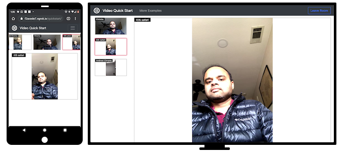

**NEW:** Please check out our [Best Practices Guide](https://www.twilio.com/docs/video/build-js-video-application-recommendations-and-best-practices)
for building video applications with twilio-video.js.

# Twilio Video Quickstart for JavaScript

[](http://travis-ci.org/twilio/video-quickstart-js) [](https://ci.appveyor.com/project/markandrus/video-quickstart-js)

_For Twilio Video 1.x Quickstart, go [here](https://github.com/twilio/video-quickstart-js/tree/1.x)._

## Overview

This application should give you a ready-made starting point for writing your
own video apps with Twilio Video.



## Setup Requirements

Before we begin, we need to collect all the config values we need to run the application:

- Account SID: Your primary Twilio account identifier - find this [in the console here](https://www.twilio.com/console).
- API Key SID: Used to authenticate - [generate one here](https://www.twilio.com/console/runtime/api-keys).
- API Key Secret: Used to authenticate - [just like the above, you'll get one here](https://www.twilio.com/console/runtime/api-keys).

### A Note on API Keys

When you generate an API key pair at the URLs above, your API Key Secret will only
be shown once - make sure to save this in a secure location,
or possibly your `~/.bash_profile`.

## Setting Up The Application

Create a configuration file for your application:

```bash
cp .env.template .env
```

Edit `.env` with the configuration parameters we gathered from above.

Next, we need to install our dependencies from npm:

```bash
npm install
```

## Running The Application

Now we should be all set! Run the application:

```bash
npm start
```

Your application should now be running at [http://localhost:3000](http://localhost:3000). You will
be prompted to test and choose your microphone and camera. On desktop browsers, your choices will
be saved. _On mobile browsers, you will be asked to test and choose your microphone and camera every
time you load the application in order to make sure they are not reserved by another application_.

After choosing your input devices, you will be prompted to enter your Room name and user name, following
which you will join the Room. Now, all you have to do is open another tab and join the same Room in order
to see and hear yourself on both tabs!

[joinroom.js](quickstart/src/joinroom.js) demonstrates how to use the SDK APIs to build a multi-party
video sesssion. You can start building your own application by incorporating this code into your own
application, and build your user interface around it.

## Running On Multiple Devices

You can use [ngrok](https://ngrok.com/) to try your application
on different devices by creating a secure tunnel to your application server:

```bash
ngrok http 3000
```

You will get a URL of the form `https://a1b2c3d4.ngrok.io` which can be loaded on a browser from a device
different than the one where your application server is running.

## Examples

The project contains some use-case examples for the Twilio Video JS SDK. After running the application
by following the instructions above, go to [http://localhost:3000/examples](http://localhost:3000/examples)
to try them out.
